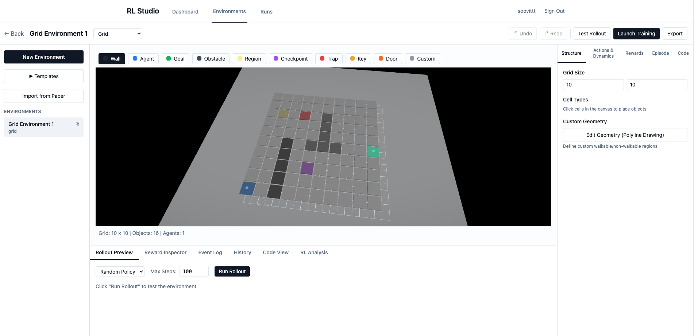
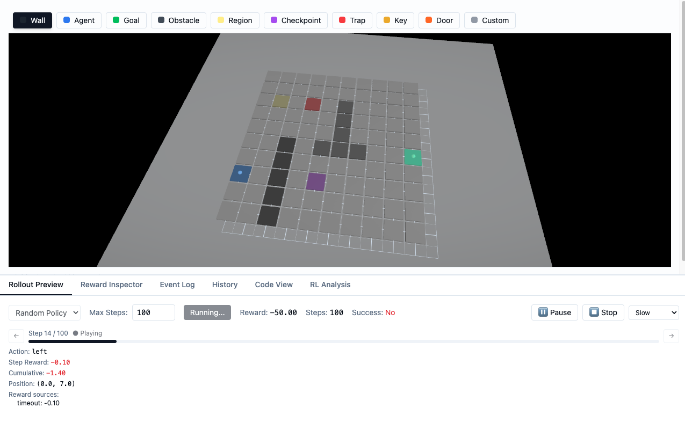
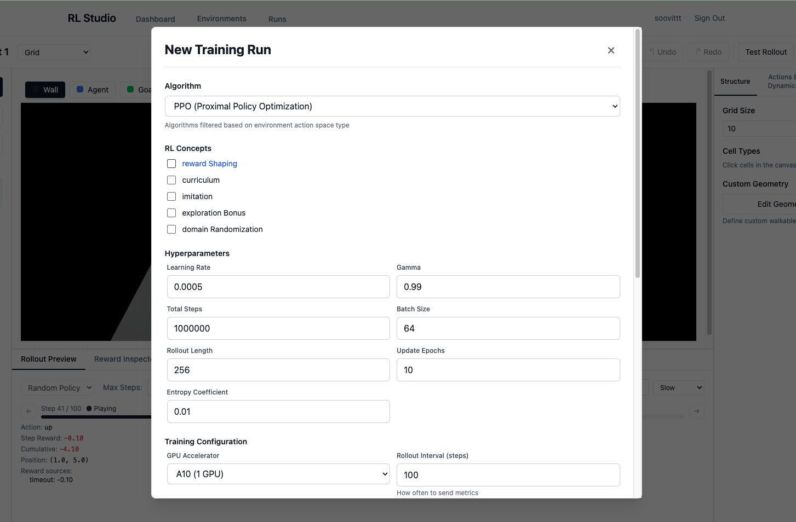
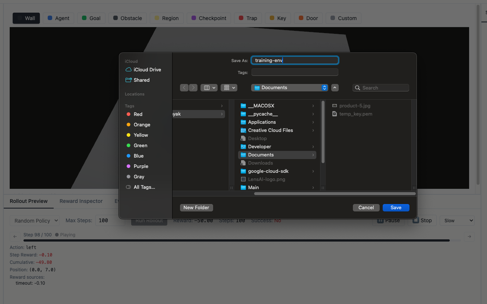

<div align="center">


# 🎮 RL Studio

**A full-stack platform for designing reinforcement learning environments, running GPU-backed training, and monitoring agents in real-time.**

[](https://opensource.org/licenses/MIT)
[](https://www.typescriptlang.org/)
[](https://www.python.org/)
[](https://reactjs.org/)
[](https://fastapi.tiangolo.com/)
[](https://graphql.org/)
[](https://www.convex.dev/)

[](http://makeapullrequest.com)
[](https://github.com/yourusername/rl-studio/graphs/contributors)
[](https://github.com/yourusername/rl-studio/issues)
[](https://github.com/yourusername/rl-studio/stargazers)

[Documentation](#-documentation) • [Quick Start](#-quick-start) • [Features](#-features) • [Contributing](#-contributing)

</div>

---

## 📖 Table of Contents

- [About](#-about)
- [Features](#-features)
- [Screenshots](#-screenshots)
- [Tech Stack](#-tech-stack)
- [Architecture](#-architecture)
- [Quick Start](#-quick-start)
- [Installation](#-installation)
- [Environment Variables Setup](#-environment-variables-setup)
- [Usage](#-usage)
- [API Documentation](#-api-documentation)
- [Development](#-development)
- [Deployment](#-deployment)
- [Contributing](#-contributing)
- [Roadmap](#-roadmap)
- [FAQ](#-faq)
- [License](#-license)
- [Acknowledgments](#-acknowledgments)

---

## 🎯 About

RL Studio is a comprehensive platform that brings together environment design, training orchestration, and real-time monitoring for reinforcement learning. Whether you're a researcher prototyping new environments or a practitioner training production models, RL Studio provides the tools you need in one unified interface.

### Key Highlights

- 🎨 **Visual Environment Builder** - Design complex RL environments without writing code
- 🚀 **One-Click Training** - Launch GPU-backed training jobs on AWS/GCP/Azure
- 📊 **Real-time Monitoring** - Track training progress with live metrics and visualizations
- 🔬 **Advanced Analysis** - Deep insights into rewards, trajectories, and policy behavior
- 📦 **Code Generation** - Export production-ready Gymnasium environments
- 📄 **Paper Import** - Import environment specs from research papers

---

## ✨ Features

### 🎨 Visual Environment Editor

- **Figma-Style World Builder**: Generic scene builder with reusable assets, prefabs, and templates
- **Asset Library**: Reusable components (characters, vehicles, props, tiles) that can be shared across projects
- **Scene Graph System**: Flexible entity-component system supporting any environment type
- **Template System**: Pre-built templates (Gridworld, Cliff Walking, Key & Door, Maze, Multi-Agent) ready to use
- **Drag-and-Drop Interface**: Design gridworld and continuous environments visually
- **Multi-Agent Support**: Create complex multi-agent scenarios
- **Custom Geometry**: Define custom shapes and obstacles
- **Real-time Preview**: See your environment as you build it

### 🚀 Training & Orchestration

- **GPU-Backed Training**: Launch training jobs on AWS/GCP/Azure via SkyPilot
- **Multiple Algorithms**: Support for PPO, DQN, A2C, BC, Imitation Learning, and more
- **Hyperparameter Tuning**: Built-in suggestions based on environment characteristics
- **Spot Instance Support**: 70% cost savings with automatic spot instance management

### 📊 Monitoring & Analysis

- **Live Metrics**: Real-time training metrics visualization
- **Reward Decomposition**: Understand which rules contribute most to rewards
- **Trajectory Visualization**: View agent paths and detect attractors
- **Policy Entropy**: Measure exploration vs exploitation
- **Termination Analysis**: Understand why episodes end

### 🔧 Developer Tools

- **Code Generation**: Auto-generate production-ready Gymnasium environments
- **Paper Import**: Import environment specs from arXiv/blog URLs via Firecrawl
- **Export Everything**: Generate complete project bundles with training scripts
- **Code Review**: AI-powered code review and validation

---

## 📸 Screenshots

### Environment Builder

<div align="center">
  
  <p><em>Design complex RL environments with our visual editor</em></p>
</div>

### Rollout Visualizer

<div align="center">
  
  <p><em>Step through episodes and debug reward triggers in real-time</em></p>
</div>

### Training Configuration

<div align="center">
  
  <p><em>Configure and launch training jobs with one click</em></p>
</div>

### Export Dialog

<div align="center">
  
  <p><em>Export production-ready code and project bundles</em></p>
</div>

---

## 🛠️ Tech Stack

### Frontend
- **Framework**: [TanStack Start](https://tanstack.com/start) (React SSR)
- **Language**: TypeScript
- **Styling**: Tailwind CSS
- **3D Graphics**: Three.js, React Three Fiber
- **State Management**: Convex (realtime database)
- **Charts**: Recharts

### Backend
- **API**: FastAPI (Python) with GraphQL support
- **GraphQL**: Strawberry GraphQL (type-safe, efficient queries)
- **Database**: Convex (realtime DB)
- **Training**: SkyPilot (GPU orchestration)
- **RL Libraries**: Stable-Baselines3, Gymnasium, PyTorch
- **Analysis**: NumPy, SciPy, scikit-learn

### Infrastructure
- **Frontend Hosting**: Netlify
- **Backend Hosting**: Google Cloud Run / AWS ECS / Railway
- **Database**: Convex Cloud
- **Training Jobs**: AWS/GCP/Azure (via SkyPilot)

---

## 🏗️ Architecture

```
┌─────────────────────────────────────────────────────────────┐
│                        Frontend (React)                      │
│  ┌──────────────┐  ┌──────────────┐  ┌──────────────┐     │
│  │   Editor     │  │  Visualizer  │  │   Training   │     │
│  └──────────────┘  └──────────────┘  └──────────────┘     │
└─────────────────────────────────────────────────────────────┘
                            │
                            ▼
┌─────────────────────────────────────────────────────────────┐
│                    Convex (Realtime DB)                      │
│  ┌──────────────┐  ┌──────────────┐  ┌──────────────┐     │
│  │ Environments │  │     Runs      │  │   Metrics    │     │
│  └──────────────┘  └──────────────┘  └──────────────┘     │
└─────────────────────────────────────────────────────────────┘
                            │
                            ▼
┌─────────────────────────────────────────────────────────────┐
│                  Backend API (FastAPI)                       │
│  ┌──────────────┐  ┌──────────────┐  ┌──────────────┐     │
│  │   Rollout    │  │   Analysis   │  │   Codegen    │     │
│  └──────────────┘  └──────────────┘  └──────────────┘     │
└─────────────────────────────────────────────────────────────┘
                            │
                            ▼
┌─────────────────────────────────────────────────────────────┐
│              Training Infrastructure (SkyPilot)             │
│  ┌──────────────┐  ┌──────────────┐  ┌──────────────┐     │
│  │     AWS      │  │      GCP      │  │    Azure     │     │
│  └──────────────┘  └──────────────┘  └──────────────┘     │
└─────────────────────────────────────────────────────────────┘
```

---

## 🚀 Quick Start

### Super Easy Setup (Recommended)

**Just run one command and add your API keys!**

```bash
# 1. Run automated setup
python setup.py

# 2. Add your API keys to .env files (see below)

# 3. Start the servers
cd backend && source venv/bin/activate && python main.py  # Terminal 1
npm run dev  # Terminal 2
```

The setup script automatically:
- ✅ Installs all dependencies
- ✅ Creates virtual environments  
- ✅ Sets up infrastructure
- ✅ Creates .env templates

**You only need to add API keys!** See [Environment Variables Setup](#-environment-variables-setup) below.

### Manual Setup (Alternative)

If you prefer manual setup:

1. **Clone the repository**

```bash
git clone https://github.com/yourusername/rl-studio.git
cd RL-Studio
```

> 💡 **Note**: This is an open-source project. You'll be setting up your own instance with your own API keys and credentials.

2. **Install dependencies**

```bash
# Install frontend dependencies
npm install

# Install backend dependencies
cd backend
python3 -m venv venv
source venv/bin/activate  # On Windows: venv\Scripts\activate
pip install -r requirements.txt
cd ..
```

3. **Set up Convex (Your Own Deployment)**

```bash
# This creates YOUR OWN Convex deployment (not shared with production)
npx convex dev
```

This will:
- Create a Convex account if needed (free tier available)
- Set up your local development environment
- Generate YOUR deployment URL (e.g., https://your-deployment.convex.cloud)

**Important**: Each user gets their own Convex deployment. This is required for open-source use.

4. **Seed Local Development Data**

```bash
# Seed sample environments, runs, and data for local development
npx convex run seed_local_data:seedAll
```

This creates sample data so you can develop without needing production data.

5. **Configure Infrastructure (Optional)**

RL Studio supports multiple cloud providers and local development:

**Quick Start (Local Only - No Cloud Required):**
```bash
# Everything runs locally - no cloud setup needed!
# Just set your Convex URL from step 3
export CONVEX_URL=https://your-deployment.convex.cloud
```

**For Cloud Storage (S3/GCS/Azure):**
See `INFRASTRUCTURE_SETUP.md` for detailed instructions. It's very easy - just set environment variables!

**Quick Example (AWS S3):**
```bash
export STORAGE_PROVIDER=s3
export S3_BUCKET_NAME=rl-studio-models
export AWS_ACCESS_KEY_ID=your-key
export AWS_SECRET_ACCESS_KEY=your-secret
```

The framework auto-detects your provider from credentials - no code changes needed!

6. **Configure environment variables**

> ⚠️ **Important**: Since this is an open-source project, you'll need to set up your own environment variables. The `.env` files are not included in the repository for security reasons.

#### Step 1: Create Root `.env` File

Create a `.env` file in the root directory of the project:

```bash
# Create the file
touch .env
```

Then add the following content (replace with your own values):

```bash
# ============================================
# CONVEX CONFIGURATION (REQUIRED)
# ============================================
# Get this URL from running: npx convex dev
# It will look like: https://your-deployment-name.convex.cloud
VITE_CONVEX_URL=https://your-deployment-name.convex.cloud

# ============================================
# OPENAI API (OPTIONAL - For Code Generation)
# ============================================
# Get your API key from: https://platform.openai.com/api-keys
# Leave empty if you don't need code generation features
OPENAI_API_KEY=sk-your-api-key-here

# ============================================
# FIRECRAWL API (OPTIONAL - For Paper Import)
# ============================================
# Get your API key from: https://firecrawl.dev
# Leave empty if you don't need paper import features
FIRECRAWL_API_KEY=your-firecrawl-api-key

# ============================================
# BACKEND SERVICE URLs (OPTIONAL)
# ============================================
# For local development, these default to localhost:8000
# For production, set these to your deployed backend URLs
VITE_ROLLOUT_SERVICE_URL=http://localhost:8000
VITE_API_URL=http://localhost:8000
VITE_TRAINING_SERVICE_URL=http://localhost:8000

# ============================================
# SENTRY (OPTIONAL - For Error Tracking)
# ============================================
# Get your DSN from: https://sentry.io
# Leave empty if you don't need error tracking
VITE_SENTRY_DSN=your-sentry-dsn
```

#### Step 2: Create Backend `.env` File

Create a `.env` file in the `backend/` directory:

```bash
# Create the file
cd backend
touch .env
cd ..
```

Then add the following content:

```bash
# ============================================
# OPENAI API (OPTIONAL - For Code Generation)
# ============================================
# Same as in root .env, or leave empty
OPENAI_API_KEY=sk-your-api-key-here

# ============================================
# AWS CREDENTIALS (OPTIONAL - For GPU Training)
# ============================================
# Get these from: https://console.aws.amazon.com/iam/
# Required only if you want to launch GPU training jobs
AWS_ACCESS_KEY_ID=your-aws-access-key-id
AWS_SECRET_ACCESS_KEY=your-aws-secret-access-key
AWS_DEFAULT_REGION=us-east-1

# ============================================
# CONVEX URL (OPTIONAL)
# ============================================
# Usually same as VITE_CONVEX_URL from root .env
CONVEX_URL=https://your-deployment-name.convex.cloud

# ============================================
# SERVER CONFIGURATION (OPTIONAL)
# ============================================
# These have sensible defaults, only change if needed
# PORT=8000
# HOST=0.0.0.0
# DEBUG=false
# CORS_ORIGINS=*
```

#### Step 3: Set Convex Environment Variables

For Convex-specific environment variables (like Firecrawl API key for Convex functions), use the Convex CLI:

```bash
# Set Firecrawl API key for Convex functions
npx convex env set FIRECRAWL_API_KEY your-firecrawl-key

# Set CodeRabbit API key (if using code review features)
npx convex env set CODERABBIT_API_KEY your-coderabbit-key
```

#### 📋 Environment Variables Quick Reference

| Variable | Location | Required | Description |
|----------|----------|-----------|-------------|
| `VITE_CONVEX_URL` | Root `.env` | ✅ Yes | Your Convex deployment URL |
| `OPENAI_API_KEY` | Root `.env` & `backend/.env` | ❌ No | For AI code generation |
| `FIRECRAWL_API_KEY` | Root `.env` & Convex | ❌ No | For paper import feature |
| `AWS_ACCESS_KEY_ID` | `backend/.env` | ❌ No | For GPU training jobs |
| `AWS_SECRET_ACCESS_KEY` | `backend/.env` | ❌ No | For GPU training jobs |
| `VITE_ROLLOUT_SERVICE_URL` | Root `.env` | ❌ No | Backend URL (defaults to localhost) |
| `VITE_API_URL` | Root `.env` | ❌ No | Backend API URL (defaults to localhost) |

#### 🔒 Security Notes

- **Never commit `.env` files** to version control (they're already in `.gitignore`)
- **Use different keys** for development and production
- **Rotate API keys** regularly for security
- **Use environment-specific files**: `.env.local` for local overrides, `.env.production` for production

#### 🆘 Troubleshooting

**Problem**: "VITE_CONVEX_URL is not set"  
**Solution**: Run `npx convex dev` to get your Convex URL, then add it to `.env`

**Problem**: "Backend connection failed"  
**Solution**: Make sure `VITE_ROLLOUT_SERVICE_URL` points to your running backend (default: `http://localhost:8000`)

**Problem**: "OpenAI API key invalid"  
**Solution**: Check that your API key starts with `sk-` and is not a placeholder value

5. **Seed the database (REQUIRED for Templates & Assets)**

**⚠️ IMPORTANT:** The new template library and asset palette won't show up until you seed the database!

### Quick Seeding (Recommended)

```bash
# 1. Get your user_id (see methods below)
# 2. Run the seeding script
./seed_database.sh <your_user_id> [optional_project_id]
```

### What Gets Seeded

**8 Templates:**
- Basic Gridworld, Cliff Walking, Key & Door, Maze, Multi-Agent Grid
- 2D Continuous Navigation, 3D Navigation, Driving Simulator

**25+ Assets:**
- Grid tiles: Agent, Goal, Wall, Key, Door, Trap, Checkpoint, etc.
- Vehicles: Car, Truck
- 3D assets: 3D Agent, 3D Obstacle, Platform
- Continuous 2D assets: Continuous Agent, Continuous Obstacle

### Where to Find Them After Seeding

1. **Templates:** Click "New Environment" → "From Template" → Look for **"Templates from Library"** section (top of dialog)
2. **Assets:** When editing an environment → Top of canvas shows **Asset Palette** with colored buttons

### Getting Your User ID

**Method 1: Browser Console**
```javascript
// Open browser console (F12) and run:
localStorage.getItem('rl_studio_user_id')
```

**Method 2: Convex Dashboard**
- Go to https://dashboard.convex.dev
- Select your project → "Data" → "users" table
- Copy any user's `_id`

**Method 3: From Existing Environment**
- Open any environment in the app
- Check its `ownerId` in Convex dashboard

### Alternative Seeding Methods

**Using Python:**
```bash
cd backend
source venv/bin/activate
python -m rl_studio.api.seed_database <user_id> [project_id]
```

**Using API:**
```bash
# Seed everything
curl -X POST http://localhost:8000/api/admin/seed/all \
  -H "Content-Type: application/json" \
  -d '{"created_by": "<user_id>", "project_id": "<project_id>"}'
```

**Verify setup:**
```bash
python -m rl_studio.api.verify_setup <user_id> <project_id>
```

6. **Start the development servers**

```bash
# Terminal 1: Start backend
cd backend
source venv/bin/activate
python main.py

# Terminal 2: Start frontend
npm run dev
```

6. **Open your browser**

Navigate to [http://localhost:3000](http://localhost:3000)

---

## ⚙️ Environment Variables Setup

> 📝 **For Open Source Contributors**: This section explains how to configure environment variables for your own RL Studio instance.

Since RL Studio is open source, you need to set up your own environment variables. Here's a comprehensive guide:

### 🎯 Quick Setup Checklist

- [ ] Clone the repository
- [ ] Install dependencies (Node.js & Python)
- [ ] Set up Convex account (`npx convex dev`)
- [ ] Create root `.env` file with `VITE_CONVEX_URL`
- [ ] Create `backend/.env` file (optional, for training features)
- [ ] Set Convex environment variables (optional, for paper import)

### 📝 Detailed Setup Guide

#### 1. Required: Convex Setup

**Convex is required** for the application to work. It's free to get started:

```bash
# This will create a Convex account and deployment
npx convex dev
```

This will output a URL like:
```
https://your-deployment-name.convex.cloud
```

**Add this to your root `.env` file:**
```bash
VITE_CONVEX_URL=https://your-deployment-name.convex.cloud
```

#### 2. Optional: OpenAI API (Code Generation)

If you want to use AI-powered code generation:

1. Get an API key from [OpenAI Platform](https://platform.openai.com/api-keys)
2. Add to both `.env` files:

**Root `.env`:**
```bash
OPENAI_API_KEY=sk-proj-...your-key-here
```

**`backend/.env`:**
```bash
OPENAI_API_KEY=sk-proj-...your-key-here
```

#### 3. Optional: Firecrawl API (Paper Import)

If you want to import environments from research papers:

1. Get an API key from [Firecrawl](https://firecrawl.dev)
2. Add to root `.env`:
```bash
FIRECRAWL_API_KEY=fc-...your-key-here
```
3. Also set in Convex:
```bash
npx convex env set FIRECRAWL_API_KEY fc-...your-key-here
```

#### 4. Optional: AWS Credentials (GPU Training)

If you want to launch GPU training jobs:

1. Create an AWS account
2. Create an IAM user with programmatic access
3. Add credentials to `backend/.env`:
```bash
AWS_ACCESS_KEY_ID=AKIA...
AWS_SECRET_ACCESS_KEY=...
AWS_DEFAULT_REGION=us-east-1
```

#### 5. Optional: Backend URLs (Production)

For production deployments, set your backend URLs in root `.env`:

```bash
VITE_ROLLOUT_SERVICE_URL=https://your-backend-url.com
VITE_API_URL=https://your-backend-url.com
VITE_TRAINING_SERVICE_URL=https://your-backend-url.com
```

For local development, these default to `http://localhost:8000`.

### 📋 Complete `.env` File Templates

#### Root `.env` (Minimum Required)

```bash
# REQUIRED - Get from: npx convex dev
VITE_CONVEX_URL=https://your-deployment-name.convex.cloud
```

#### Root `.env` (Full Example)

```bash
# ============================================
# REQUIRED
# ============================================
VITE_CONVEX_URL=https://your-deployment-name.convex.cloud

# ============================================
# OPTIONAL - Code Generation
# ============================================
OPENAI_API_KEY=sk-proj-your-key-here

# ============================================
# OPTIONAL - Paper Import
# ============================================
FIRECRAWL_API_KEY=fc-your-key-here

# ============================================
# OPTIONAL - Backend URLs (for production)
# ============================================
# VITE_ROLLOUT_SERVICE_URL=https://your-backend.com
# VITE_API_URL=https://your-backend.com
# VITE_TRAINING_SERVICE_URL=https://your-backend.com
```

#### `backend/.env` (Full Example)

```bash
# ============================================
# OPTIONAL - Code Generation
# ============================================
OPENAI_API_KEY=sk-proj-your-key-here

# ============================================
# OPTIONAL - AWS for GPU Training
# ============================================
AWS_ACCESS_KEY_ID=AKIA...
AWS_SECRET_ACCESS_KEY=...
AWS_DEFAULT_REGION=us-east-1

# ============================================
# OPTIONAL - Convex (usually same as VITE_CONVEX_URL)
# ============================================
CONVEX_URL=https://your-deployment-name.convex.cloud

# ============================================
# OPTIONAL - Server Config
# ============================================
# PORT=8000
# HOST=0.0.0.0
# DEBUG=false
```

### 🔍 Verifying Your Setup

After setting up your `.env` files, verify everything works:

```bash
# 1. Check Convex connection
npx convex dev
# Should show: "✅ Convex functions are ready"

# 2. Start backend
cd backend
source venv/bin/activate
python main.py
# Should show: "✅ Loaded .env from backend/.env"

# 3. Start frontend
npm run dev
# Should open at http://localhost:3000
```

### 🆘 Common Issues

| Issue | Solution |
|-------|----------|
| `VITE_CONVEX_URL is not set` | Run `npx convex dev` and add the URL to `.env` |
| `Backend connection failed` | Make sure backend is running on port 8000 |
| `OpenAI API key invalid` | Check that your key starts with `sk-` |
| `AWS credentials not found` | Only needed for GPU training, can be skipped for local dev |

### 🔐 Security Best Practices

1. **Never commit `.env` files** - They're already in `.gitignore`
2. **Use different keys for dev/prod** - Create separate `.env.local` and `.env.production`
3. **Rotate keys regularly** - Especially for production
4. **Use environment variables in CI/CD** - Don't hardcode secrets

---

## 📚 Documentation

### Core Workflows

#### Creating an Environment

1. Click **"New Environment"** in the dashboard
2. Choose environment type (Grid or Continuous)
3. Design your environment:
   - Add agents, goals, obstacles
   - Define reward rules
   - Set termination conditions
   - Configure action/observation spaces
4. Save your environment

#### Running Rollouts

1. Open your environment
2. Go to **"Rollout Preview"** tab
3. Configure rollout settings (max steps, policy)
4. Click **"Run Rollout"**
5. View results and analysis in real-time

#### Launching Training

1. Open your environment
2. Click **"Launch Training"**
3. Configure training settings:
   - **Algorithm**: PPO, DQN, A2C, BC, Imitation, or Random
   - **Hyperparameters**: Learning rate, gamma, total steps, etc.
   - **GPU**: Select GPU type (A10:1 recommended)
   - **Parallel Environments**: Number of parallel envs
4. Click **"Launch Training"**
5. Monitor progress in real-time

#### RL Analysis

After running rollouts, use the **"RL Analysis"** tab to:
- **Reward Decomposition**: See which rules contribute most to rewards
- **Trajectory Visualization**: View agent paths and detect attractors
- **Policy Entropy**: Measure exploration vs exploitation
- **Termination Analysis**: Understand why episodes end

---

## 🔌 API Documentation

### GraphQL API (Primary) ✅

RL Studio uses **GraphQL as the primary API** for all core operations. The GraphQL API provides type-safe, efficient queries and mutations with a single endpoint.

**Status**: ✅ **Fully Operational** - All core operations use GraphQL. The frontend and backend are fully migrated to GraphQL.

**GraphQL Endpoint**: `http://localhost:8000/graphql`

**GraphQL Playground**: Visit `http://localhost:8000/graphql` in your browser for an interactive query explorer with auto-completion and documentation.

#### Why GraphQL?

- ✅ **Type-Safe**: Compile-time type checking with Strawberry GraphQL
- ✅ **Efficient**: Fetch only the fields you need, reducing payload size
- ✅ **Single Endpoint**: All operations through one endpoint
- ✅ **Introspection**: Auto-generated documentation and schema exploration
- ✅ **Flexible**: Combine multiple queries in a single request

#### Example Queries

**List Assets:**
```graphql
query {
  assets(filter: { mode: "grid" }) {
    id
    name
    assetType
    geometry
    visualProfile
  }
}
```

**Get Single Asset:**
```graphql
query {
  asset(id: "asset_id_here") {
    id
    name
    geometry
    visualProfile
    physicsProfile
    behaviorProfile
  }
}
```

**Create Asset:**
```graphql
mutation {
  createAsset(input: {
    name: "My Asset"
    assetTypeKey: "tile"
    visualProfile: "{\"color\": \"#FF0000\"}"
  }) {
    id
    name
  }
}
```

**List Scenes:**
```graphql
query {
  scenes(filter: { search: "gridworld" }) {
    id
    name
    createdAt
    createdBy
  }
}
```

**Run Rollout:**
```graphql
mutation {
  runRollout(input: {
    envSpec: "{\"world\": {\"width\": 10, \"height\": 10}}"
    policy: "random"
    maxSteps: 100
  }) {
    success
    totalReward
    episodeLength
    steps {
      stepNumber
      reward
      done
    }
  }
}
```

**Launch Training:**
```graphql
mutation {
  launchTraining(input: {
    runId: "run_123"
    envSpec: "{\"world\": {\"width\": 10}}"
    config: "{\"algorithm\": \"ppo\"}"
    useManagedJobs: true
  }) {
    id
    status {
      status
      jobId
    }
  }
}
```

**Training Status:**
```graphql
query {
  trainingStatus(jobId: "job_123") {
    status
    jobId
    progress
    logs
  }
}
```

**Research Operations:**
```graphql
# Hyperparameter Sweep
mutation {
  generateHyperparameterSweep(input: {
    algorithm: "ppo"
    envSpec: "{...}"
    baseConfig: "{...}"
    searchSpace: "{...}"
    searchType: "grid"
    nTrials: 10
  }) {
    success
    nTrials
    trials {
      trialNumber
      hyperparameters
    }
  }
}

# Compare Runs
mutation {
  compareRuns(input: {
    runResults: "[{...}]"
    metric: "mean_reward"
    alpha: 0.05
  }) {
    success
    comparison {
      metric
      bestRun
      worstRun
      statisticalTest
    }
  }
}

# Model Versioning
query {
  listCheckpoints(runId: "run_123") {
    checkpointName
    path
    createdAt
  }
  
  listModelVersions(runId: "run_123") {
    versionName
    checkpointName
    tags
    modelPath
  }
}
```

**W&B Integration:**
```graphql
# Test Connection
mutation {
  testWandbConnection(input: {
    apiKey: "your-api-key"
  }) {
    success
    message
    wandbAuthenticated
  }
}

# List Runs
query {
  listWandbRuns(project: "rl-studio", apiKey: "your-key") {
    id
    name
    state
    url
  }
}

# Get Run Details
query {
  getWandbRun(runId: "run_id", project: "rl-studio", apiKey: "your-key") {
    runId
    runName
    metrics
    summary
    url
  }
}
```

### Additional API Endpoints

Some operations still use REST endpoints (not yet migrated to GraphQL):

- `/ws/rollout` - WebSocket endpoint for real-time rollout streaming (GraphQL doesn't support WebSocket subscriptions)
- `/api/codegen/*` - Code generation utilities
- `/api/templates/*` - Template management
- `/api/analysis/*` - Analysis operations
- `/api/verification/*` - Verification utilities
- `/api/benchmarks/*` - Benchmark operations
- `/api/infrastructure/*` - Infrastructure management
- `/api/admin/*` - Admin operations
- `/api/ingestion/*` - Data ingestion

**API Documentation**:
- **GraphQL Playground**: http://localhost:8000/graphql (interactive query explorer with auto-completion)
- **Swagger UI**: http://localhost:8000/docs (for REST endpoints)
- **ReDoc**: http://localhost:8000/redoc

---

## 💻 Development

### Project Structure

```
rl-studio/
├── app/                    # Frontend (TanStack Start)
│   ├── components/         # React components
│   ├── lib/               # Utilities and clients
│   └── routes/            # Page routes
├── backend/               # Python backend
│   ├── rl_studio/        # Core RL logic
│   │   ├── api/          # API layer
│   │   │   ├── graphql/   # GraphQL API (primary)
│   │   │   └── ...       # Business logic functions (used by GraphQL)
│   │   ├── rollout/      # Rollout simulator
│   │   ├── training/     # Training orchestration
│   │   ├── analysis/     # RL analysis (NumPy/SciPy)
│   │   └── codegen/      # Code generation
│   └── main.py           # Backend entry point
├── convex/               # Convex backend
│   ├── environments.ts   # Environment schema
│   ├── runs.ts           # Training runs
│   └── metrics.ts        # Training metrics
└── training/             # Training scripts
    └── train.py          # Main training script
```

### Development Commands

```bash
# Frontend
npm run dev      # Start dev server
npm run build    # Build for production
npm run lint     # Run linter
npm run test     # Run tests
npm run format   # Format code

# Backend
cd backend
source venv/bin/activate
python main.py           # Start FastAPI server
python -m pytest         # Run tests (if configured)

# Convex
npx convex dev           # Start Convex dev server
npx convex deploy        # Deploy to production
```

### Code Style

- **Frontend**: ESLint + Prettier
- **Backend**: Black (Python formatter)
- **TypeScript**: Strict mode enabled
- **Python**: Type hints required

---

## 🏗️ Figma-Style World Builder Architecture

RL Studio now includes a powerful, generic world builder inspired by Figma's component system. This allows you to create any type of RL environment using reusable building blocks.

### Core Concepts

- **Assets**: Reusable definitions (characters, vehicles, props, tiles, etc.)
- **Prefabs**: Composed assets made from other assets (e.g., "road intersection")
- **Scenes**: A graph of entities (instances of assets/prefabs) with transforms and components
- **Templates**: Saved scenes that users can clone (e.g., "10×10 Grid World")
- **Components**: Attach semantics to entities (physics, render info, RL agent, reward zone)
- **RL Config**: How the scene is interpreted as an RL environment (observation, actions, rewards, episode config)

### Data Model

The system uses a flexible schema stored in Convex:

- **assetTypes**: Categories of assets (tile, character, vehicle, prop, prefab)
- **assets**: Reusable asset definitions with visual, physics, and behavior profiles
- **scenes**: Scene metadata (name, mode, environment settings)
- **sceneVersions**: Versioned snapshots of scene graphs and RL configs
- **templates**: Pre-built scenes ready to instantiate

### API Services

**GraphQL (Primary API):**
- **Assets**: `assets`, `asset`, `createAsset`, `updateAsset`, `deleteAsset` mutations/queries
- **Scenes**: `scenes`, `scene`, `createScene`, `updateScene`, `createSceneVersion` mutations/queries
- **Training**: `launchTraining`, `stopTraining`, `trainingStatus` mutations/queries
- **Rollout**: `runRollout` mutation
- **Research**: `generateHyperparameterSweep`, `compareRuns`, `calculateConfidenceInterval`, `calculateEffectSize`, model versioning, W&B/MLflow operations

**Additional Services (REST):**
- **Template Service** (`/api/templates`): Template management
- **Compile Service** (`/api/compile`): Scene compilation
- **WebSocket** (`/ws/rollout`): Real-time rollout streaming

### Performance Features

- **Caching**: In-memory TTL cache for assets and templates (5-10 minute TTL)
- **Cache Invalidation**: Automatic cache invalidation on create/update/delete operations
- **Pagination**: Support for limiting and offsetting results in list queries
- **Asset Safety**: Validation prevents deleting assets that are referenced in scenes

### Seeding Initial Data

The system comes with pre-built assets and templates:

**Assets:**
- Grid tiles: Wall, Agent, Goal, Key, Door, Trap, Checkpoint, Moving Obstacle, Floor, Spawn Point
- All assets include visual profiles (colors, sizes), physics profiles (colliders, mass), and behavior profiles

**Templates:**
- Basic Gridworld: Simple 10×10 grid with agent and goal
- Cliff Walking: Agent must avoid cliff cells
- Key & Door Grid: Sequential task requiring key collection
- Maze Generator: Randomly generated mazes
- Multi-Agent Grid (Cooperative): Multiple agents working together
- 2D Continuous Navigation: Continuous 2D space with obstacles
- 3D Navigation: 3D environment with spatial reasoning
- Driving Simulator: Vehicle control with steering and acceleration

### Usage Example

```python
# List available templates
templates = await list_templates(mode="grid", category="grid")

# Instantiate a template into your project
scene = await instantiate_template(
    template_id="template_id",
    project_id="project_id",
    name="My Gridworld"
)

# Get scene with active version
scene_data = await get_scene(scene_id)
scene_graph = scene_data["activeVersion"]["sceneGraph"]
rl_config = scene_data["activeVersion"]["rlConfig"]

# Compile to runtime spec
runtime_spec = await compile_scene_version(scene_data["activeVersion"]["_id"])

# Clone an asset to a project scope
cloned_asset = await clone_asset(asset_id, project_id="project_id")

# Create a template from a scene version
template = await create_template(
    name="My Template",
    sceneVersionId=version_id,
    category="grid",
    tags=["custom"],
    isPublic=False
)
```

### Asset Management

Assets can be:
- **Created**: Define new reusable assets with visual, physics, and behavior profiles
- **Cloned**: Copy global assets to project scope or duplicate within same scope
- **Updated**: Modify asset properties while maintaining references
- **Deleted**: Safe deletion with validation (prevents deletion if referenced in scenes)
- **Searched**: Filter by type, mode, tags, or project

### Template Management

Templates can be:
- **Created**: Save any scene version as a reusable template
- **Listed**: Filter by mode, category, or public/private status
- **Instantiated**: Clone templates into new scenes with copied scene graphs and RL configs
- **Shared**: Mark templates as public for team-wide access

For more details, see the API documentation and code in:
- **GraphQL API** (Primary): `backend/rl_studio/api/graphql/` - Complete GraphQL implementation
  - Types: `backend/rl_studio/api/graphql/types/` - GraphQL type definitions
  - Resolvers: `backend/rl_studio/api/graphql/resolvers/` - Query/mutation resolvers
  - Schema: `backend/rl_studio/api/graphql/schema.py` - Main schema definition
- **Templates**: `backend/rl_studio/api/templates.py` - Template management (REST)
- **Compile**: `backend/rl_studio/api/compile.py` - Scene compilation (REST)
- **Caching**: `backend/rl_studio/api/cache.py` - Shared caching layer

---

## 🚢 Deployment

### Frontend (Netlify)

```bash
npm run build
# Deploy dist/ to Netlify
# Set environment variable: VITE_CONVEX_URL
```

### Backend (Multiple Options)

#### Option 1: Google Cloud Run (Recommended)

```bash
cd backend
./deploy-gcp.sh
```

Or manually:

```bash
gcloud run deploy rl-studio-backend \
  --source . \
  --platform managed \
  --region us-central1 \
  --allow-unauthenticated \
  --set-env-vars "CONVEX_URL=$CONVEX_URL,PORT=8080"
```

#### Option 2: AWS (ECS/Fargate)

```bash
cd backend
./aws-deploy.sh
```

#### Option 3: Railway (Easiest)

1. Go to [Railway](https://railway.app)
2. New Project → Deploy from GitHub
3. Select your repo
4. Add Service → Empty Service
5. Root Directory: `backend`
6. Build Command: `pip install -r requirements.txt`
7. Start Command: `python main.py`
8. Add environment variable: `CONVEX_URL`

### Convex

```bash
npx convex deploy
```

### Training Infrastructure

Training jobs are automatically deployed via SkyPilot when launched from the UI. No manual deployment needed!

---

## 💰 Cost Estimates

### Training Costs

- **A10:1 GPU**: ~$1.00/hour (on-demand) or ~$0.30/hour (spot)
- **1M training steps**: ~2-4 hours = ~$2-4 (on-demand) or ~$0.60-1.20 (spot)

**💡 Recommendation**: Enable spot instances for 70% cost savings!

### Infrastructure Costs

- **Convex**: Free tier available, then usage-based
- **Frontend Hosting**: Free on Netlify (hobby tier)
- **Backend Hosting**: ~$5-20/month (depending on traffic)

---

## 🤝 Contributing

We welcome contributions! Please see our [Contributing Guide](CONTRIBUTING.md) for details.

### Quick Contribution Guide

1. **Fork the repository**
2. **Create a feature branch**
   ```bash
   git checkout -b feature/amazing-feature
   ```
3. **Make your changes**
4. **Commit your changes**
   ```bash
   git commit -m 'Add some amazing feature'
   ```
5. **Push to the branch**
   ```bash
   git push origin feature/amazing-feature
   ```
6. **Open a Pull Request**

### Development Setup

See [Development](#-development) section for setup instructions.

### Code of Conduct

Please read our [Code of Conduct](CODE_OF_CONDUCT.md) before contributing.

---

## 🗺️ Roadmap

- [ ] **Multi-Agent Training**: Enhanced support for multi-agent RL
- [ ] **Custom Algorithms**: Plugin system for custom RL algorithms
- [ ] **Distributed Training**: Support for distributed training across multiple GPUs
- [ ] **Environment Templates**: Pre-built templates for common RL tasks
- [ ] **Collaboration Features**: Real-time collaboration on environments
- [ ] **Model Zoo**: Pre-trained models and benchmarks
- [ ] **Mobile App**: Mobile app for monitoring training jobs
- [ ] **API SDK**: Official SDKs for Python, JavaScript, and Rust

See our [Issues](https://github.com/yourusername/rl-studio/issues) for more planned features.

---

## ❓ FAQ

### General

**Q: Is RL Studio free to use?**  
A: Yes! RL Studio is open source and free. You only pay for cloud infrastructure (GPU training jobs, hosting, etc.).

**Q: What cloud providers are supported?**  
A: AWS, Google Cloud Platform, and Microsoft Azure are all supported via SkyPilot.

**Q: Can I use RL Studio without cloud training?**  
A: Yes! You can use RL Studio for environment design and local rollouts without any cloud setup.

### Technical

**Q: What Python version is required?**  
A: Python 3.9 or higher.

**Q: Can I deploy on my own infrastructure?**  
A: Yes! RL Studio is fully open source and can be deployed anywhere.

**Q: How do I add a custom RL algorithm?**  
A: Currently, you can modify the training scripts. We're working on a plugin system for easier extensibility.

### Training

**Q: How much do GPU training jobs cost?**  
A: See [Cost Estimates](#-cost-estimates) section. Costs vary by provider and instance type.

**Q: Can I use spot instances?**  
A: Yes! SkyPilot automatically manages spot instances for cost savings.

**Q: How long do training jobs take?**  
A: Depends on your environment and hyperparameters. Typical jobs range from 1-4 hours for 1M steps.

---

## 📝 License

This project is licensed under the MIT License - see the [LICENSE](LICENSE) file for details.

---

## 🙏 Acknowledgments

RL Studio is built with amazing open-source tools and libraries:

- [Stable-Baselines3](https://github.com/DLR-RM/stable-baselines3) - RL algorithms
- [Gymnasium](https://github.com/Farama-Foundation/Gymnasium) - RL environments
- [SkyPilot](https://github.com/skypilot-org/skypilot) - GPU orchestration
- [TanStack Start](https://tanstack.com/start) - React framework
- [Convex](https://www.convex.dev/) - Realtime database
- [FastAPI](https://fastapi.tiangolo.com/) - Python API framework
- [Three.js](https://threejs.org/) - 3D graphics

Special thanks to all [contributors](https://github.com/yourusername/rl-studio/graphs/contributors) who have helped make RL Studio better!

---

<div align="center">

**Made with ❤️ for the RL community**

[Get Started](#-quick-start) • [Documentation](#-documentation) • [Contributing](#-contributing) • [License](#-license)

[⭐ Star us on GitHub](https://github.com/yourusername/rl-studio) • [🐛 Report Bug](https://github.com/yourusername/rl-studio/issues) • [💡 Request Feature](https://github.com/yourusername/rl-studio/issues)

</div>
